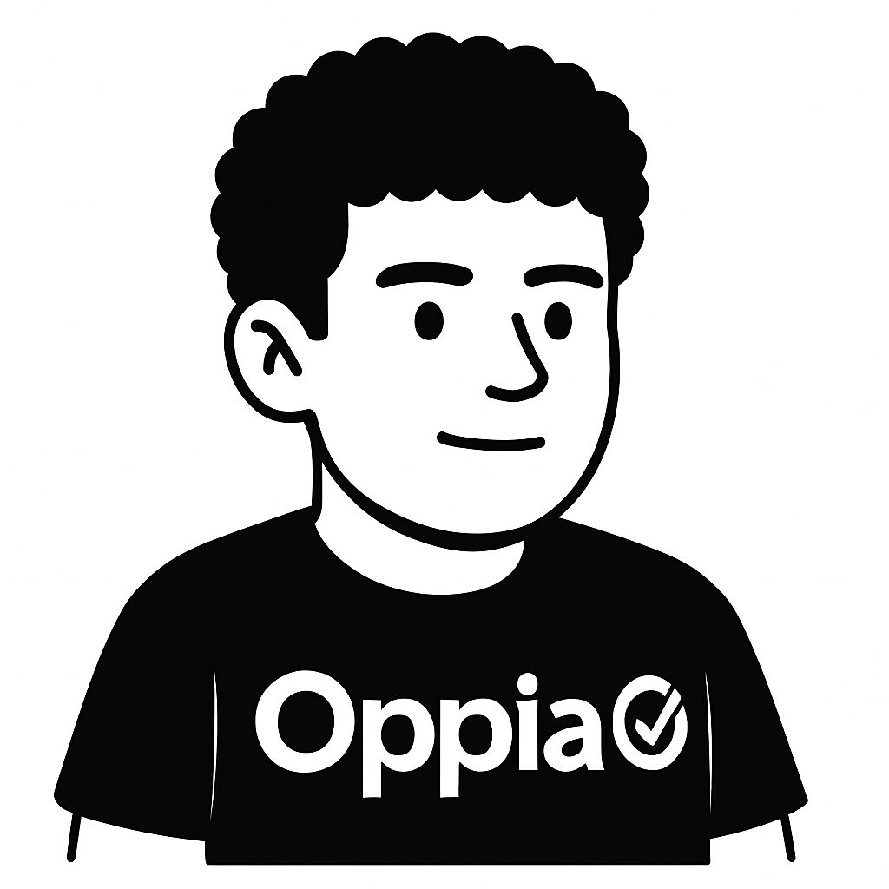

# Oppia Software Labs

**Technology with purpose. Impact over hype. Direction over noise. 🎯🌟**

Oppia Software Labs (OS Labs) is a Web3 innovation studio dedicated to building **open-source, decentralized solutions with real-world impact**.
We believe in decentralization, transparency, and user empowerment — creating technology that makes a meaningful difference.

---

## 🚀 Our Mission

To harness the potential of blockchain and Web3 technologies to design **scalable, impactful solutions** that improve how people interact with everyday systems — starting with **social good**, and expanding into **DeFi and beyond**.

---

## 🚧 What We’re Working On

We’re building a growing portfolio of projects designed to empower communities and create positive change:

* **Kredible (DeFi)** → A decentralized lending platform that calculates fair Loan-to-Value (LTV) ratios based on trusted on-chain credit scores.
* **Upcoming Projects** → Tools for financial inclusion, decentralized education, and social good initiatives.

---

## 🛠️ Tech Stack

* **Web3 / Blockchain (Stellar)**
* **React / Node.js**
* **IPFS / Decentralized Storage** *(planned)*
* **Smart Contracts (Soroban)** *(planned)*

---

<h3 align="center">🛠️ Founders:</h3>
<table align="center" cellpadding="10">
  <tr>
    <td align="center">
      
        
      <strong>Founder</strong>
       
      Santiago Villarreal
        
      <a href="https://github.com/Villarley" target="_blank">GitHub</a> | 
      <a href="https://t.me/villarley" target="_blank">Telegram</a>
    </td>
    <td align="center">
      
        
      <strong>Founder</strong>
       
      Kevin Latino
        
      <a href="https://github.com/KevinLatino" target="_blank">GitHub</a> | 
      <a href="https://t.me/kevlatino" target="_blank">Telegram</a>
    </td>
        <td align="center">
      
        
      <strong>Founder</strong>
       
      Matías Aguilar
        
      <a href="https://github.com/aguilar1x/" target="_blank">GitHub</a> | 
      <a href="https://t.me/aguilar1x" target="_blank">Telegram</a>
    </td>
        <td align="center">
      
        
      <strong>Founder</strong>
       
      Fabián Sanchez
        
      <a href="https://github.com/FabianShanchezD" target="_blank">GitHub</a> | 
      <a href="https://t.me/" target="_blank">Telegram</a>
    </td>
  </tr>
</table>

 

Join us and: create, explore and expand 🌎⚡️

